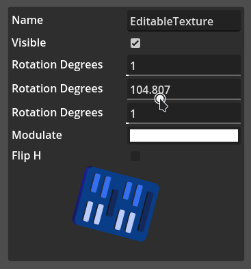

# Property Panel Addon  

A panel similar to the Inspector inside the Godot Engine. Can be used to expose various values inside tools / games.

**Supports:**

* Strings
* Boolean values
* Floating point or integer values
* Colors
* Enums
* Exposing file paths which open a file dialog when clicking them
* Custom properties (see `properties.gd` for a tutorial)

## Installation

Download a [release](https://github.com/Jummit/property-panel/releases) and put it into your addon folder. Enabling the addon is not necessary as of now.

## Screenshots



## Usage

Add a `PropertyPanel` to your scene.

## Example Code

In this example a sprite's values are exposed in a property panel.

```gdscript
const Properties = preload("res://addons/property_panel/properties.gd")

func _ready():
	$PropertyPanel.set_properties([
		Properties.StringProperty.new("name", "A Texture"),
		Properties.BoolProperty.new("visible", true),
		Properties.FloatProperty.new("rotation_degrees", 1, 360),
		Properties.ColorProperty.new("modulate"),
		Properties.BoolProperty.new("flip_h"),
	])

func _on_PropertyPanel_property_changed(property, value):
	$Sprite[property] = value
```
